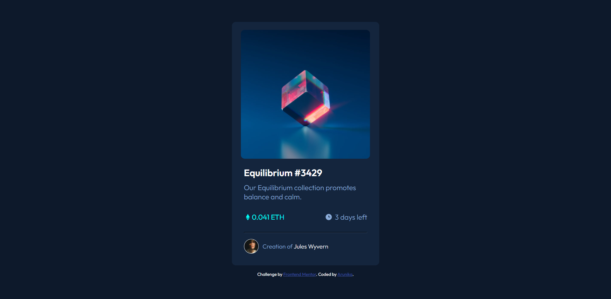

# Frontend Mentor - NFT preview card component solution

This is a solution to the [NFT preview card component challenge on Frontend Mentor](https://www.frontendmentor.io/challenges/nft-preview-card-component-SbdUL_w0U). Frontend Mentor challenges help you improve your coding skills by building realistic projects.

## Table of contents

- [Overview](#overview)
  - [The challenge](#the-challenge)
  - [Screenshot](#screenshot)
  - [Links](#links)
- [My process](#my-process)
  - [Built with](#built-with)
  - [What I learned](#what-i-learned)
  - [Continued development](#continued-development)
  - [Useful resources](#useful-resources)
- [Author](#author)
- [Acknowledgments](#acknowledgments)

**Note: Delete this note and update the table of contents based on what sections you keep.**

## Overview

### The challenge

Users should be able to:

- View the optimal layout depending on their device's screen size
- See hover states for interactive elements

### Screenshot



### Links

- Solution URL: [Github](https://github.com/shidqiiii/NFT-preview-card-component)
- Live Site URL: [Netlify](https://nft-card-dev-arunika.netlify.app/)

## My process

### Built with

- Semantic HTML5 markup
- CSS custom properties
- Flexbox

**Note: These are just examples. Delete this note and replace the list above with your own choices**

### What I learned

Learn to use semantic HTML5 markup and CSS with additional flexbox and transition hover

To see how you can add code snippets, see below:

```css
.image-overlay {
  width: 300px;
  height: 100%;
  position: absolute;
  top: 50%;
  left: 50%;
  transform: translate(-50%, -50%);
  background-color: hsla(178, 100%, 50%, 0.3);
  display: flex;
  align-items: center;
  justify-content: center;
  opacity: 0;
  transition: opacity 0.5s;
  cursor: pointer;
  border-radius: 10px;
}
```

## Author

- Website - [Arunika](https://arunikaproject.netlify.app/)
- Frontend Mentor - [@shidqiiii](https://www.frontendmentor.io/profile/shidqiiii)
